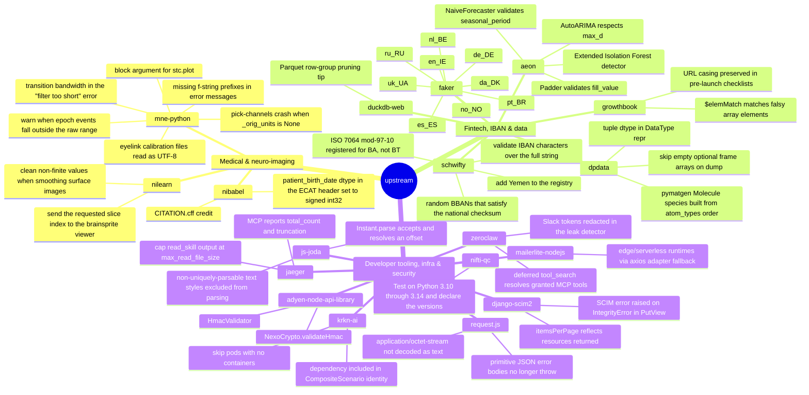

# Cedric Conday

## Merged upstream

Each one a bug found, reproduced, fixed with a regression test, and merged.

<!-- Generated by .github/scripts/build_record.py — do not hand-edit between the
     markers. Blurbs live in .github/data/record.json and are preserved across
     rebuilds. Counts are deliberately absent; do not reintroduce them. -->

<!-- MAP:START -->

<!-- MAP:END -->

Link index — every node above, with its pull request

<!-- RECORD:START -->
**Medical & neuro-imaging**
- [mne-tools/mne-python](https://github.com/mne-tools/mne-python) — neuroimaging · [#14002](https://github.com/mne-tools/mne-python/pull/14002 "eyelink calibration files read as UTF-8") [#14004](https://github.com/mne-tools/mne-python/pull/14004 "warn when epoch events fall outside the raw range") [#14005](https://github.com/mne-tools/mne-python/pull/14005 "transition bandwidth in the 'filter too short' error") [#14006](https://github.com/mne-tools/mne-python/pull/14006 "pick-channels crash when `_orig_units` is None") [#14008](https://github.com/mne-tools/mne-python/pull/14008 "missing f-string prefixes in error messages") [#14185](https://github.com/mne-tools/mne-python/pull/14185 "`block` argument for `stc.plot()`")
- [nipy/nibabel](https://github.com/nipy/nibabel) — medical imaging · [#1522](https://github.com/nipy/nibabel/pull/1522 "`patient_birth_date` dtype in the ECAT header set to signed int32") [#1524](https://github.com/nipy/nibabel/pull/1524 "CITATION.cff credit")
- [nilearn/nilearn](https://github.com/nilearn/nilearn) — neuroimaging · [#6503](https://github.com/nilearn/nilearn/pull/6503 "clean non-finite values when smoothing surface images") [#6505](https://github.com/nilearn/nilearn/pull/6505 "send the requested slice index to the brainsprite viewer")

**Fintech, IBAN & data**
- [joke2k/faker](https://github.com/joke2k/faker) — test data · IBAN generators · [#2403](https://github.com/joke2k/faker/pull/2403 "de_DE") [#2404](https://github.com/joke2k/faker/pull/2404 "es_ES") [#2409](https://github.com/joke2k/faker/pull/2409 "da_DK") [#2410](https://github.com/joke2k/faker/pull/2410 "pt_BR") [#2411](https://github.com/joke2k/faker/pull/2411 "en_IE") [#2412](https://github.com/joke2k/faker/pull/2412 "nl_BE") [#2415](https://github.com/joke2k/faker/pull/2415 "no_NO") [#2416](https://github.com/joke2k/faker/pull/2416 "ru_RU") [#2417](https://github.com/joke2k/faker/pull/2417 "uk_UA")
- [mdomke/schwifty](https://github.com/mdomke/schwifty) — banking identifiers · [#292](https://github.com/mdomke/schwifty/pull/292 "ISO 7064 mod-97-10 registered for BA, not BT") [#293](https://github.com/mdomke/schwifty/pull/293 "validate IBAN characters over the full string") [#294](https://github.com/mdomke/schwifty/pull/294 "add Yemen to the registry") [#296](https://github.com/mdomke/schwifty/pull/296 "random BBANs that satisfy the national checksum")
- [aeon-toolkit/aeon](https://github.com/aeon-toolkit/aeon) — time-series ML · [#3585](https://github.com/aeon-toolkit/aeon/pull/3585 "`Padder` validates `fill_value`") [#3614](https://github.com/aeon-toolkit/aeon/pull/3614 "`AutoARIMA` respects `max_d`") [#3615](https://github.com/aeon-toolkit/aeon/pull/3615 "`NaiveForecaster` validates `seasonal_period`") [#3626](https://github.com/aeon-toolkit/aeon/pull/3626 "Extended Isolation Forest detector")
- [deepmodeling/dpdata](https://github.com/deepmodeling/dpdata) — computational chemistry · [#1005](https://github.com/deepmodeling/dpdata/pull/1005 "tuple dtype in `DataType` repr") [#1010](https://github.com/deepmodeling/dpdata/pull/1010 "pymatgen `Molecule` species built from `atom_types` order") [#1011](https://github.com/deepmodeling/dpdata/pull/1011 "skip empty optional frame arrays on dump")
- [growthbook/growthbook](https://github.com/growthbook/growthbook) — feature flags · [#6238](https://github.com/growthbook/growthbook/pull/6238 "URL casing preserved in pre-launch checklists") [#6323](https://github.com/growthbook/growthbook/pull/6323 "`$elemMatch` matches falsy array elements")
- [duckdb/duckdb-web](https://github.com/duckdb/duckdb-web) — databases · [#6983](https://github.com/duckdb/duckdb-web/pull/6983 "Parquet row-group pruning tip")

**Developer tooling, infra & security**
- [zeroclaw-labs/zeroclaw](https://github.com/zeroclaw-labs/zeroclaw) — agent infrastructure · [#8775](https://github.com/zeroclaw-labs/zeroclaw/pull/8775 "deferred `tool_search` resolves granted MCP tools") [#8918](https://github.com/zeroclaw-labs/zeroclaw/pull/8918 "Slack tokens redacted in the leak detector")
- [jaegertracing/jaeger](https://github.com/jaegertracing/jaeger) — observability (CNCF) · [#8902](https://github.com/jaegertracing/jaeger/pull/8902 "MCP reports `total_count` and truncation") [#8993](https://github.com/jaegertracing/jaeger/pull/8993 "cap `read_skill` output at `max_read_file_size`")
- [octokit/request.js](https://github.com/octokit/request.js) — developer tooling · [#820](https://github.com/octokit/request.js/pull/820 "primitive JSON error bodies no longer throw") [#823](https://github.com/octokit/request.js/pull/823 "`application/octet-stream` not decoded as text")
- [js-joda/js-joda](https://github.com/js-joda/js-joda) — date & time · [#804](https://github.com/js-joda/js-joda/pull/804 "`Instant.parse` accepts and resolves an offset") [#810](https://github.com/js-joda/js-joda/pull/810 "non-uniquely-parsable text styles excluded from parsing")
- [krkn-chaos/krkn-ai](https://github.com/krkn-chaos/krkn-ai) — chaos engineering · [#382](https://github.com/krkn-chaos/krkn-ai/pull/382 "dependency included in `CompositeScenario` identity") [#397](https://github.com/krkn-chaos/krkn-ai/pull/397 "skip pods with no containers")
- [Adyen/adyen-node-api-library](https://github.com/Adyen/adyen-node-api-library) — payments · HMAC length guards · [#1712](https://github.com/Adyen/adyen-node-api-library/pull/1712 "`NexoCrypto.validateHmac`") [#1725](https://github.com/Adyen/adyen-node-api-library/pull/1725 "`HmacValidator`")
- [15five/django-scim2](https://github.com/15five/django-scim2) — identity (SCIM) · [#210](https://github.com/15five/django-scim2/pull/210 "`itemsPerPage` reflects resources returned") [#214](https://github.com/15five/django-scim2/pull/214 "SCIM error raised on `IntegrityError` in `PutView`")
- [mailerlite/mailerlite-nodejs](https://github.com/mailerlite/mailerlite-nodejs) — email · [#107](https://github.com/mailerlite/mailerlite-nodejs/pull/107 "edge/serverless runtimes via axios adapter fallback")
- [CedricConday/nifti-qc](https://github.com/CedricConday/nifti-qc) · [#1](https://github.com/CedricConday/nifti-qc/pull/1 "Test on Python 3.10 through 3.14 and declare the versions")
<!-- RECORD:END -->

